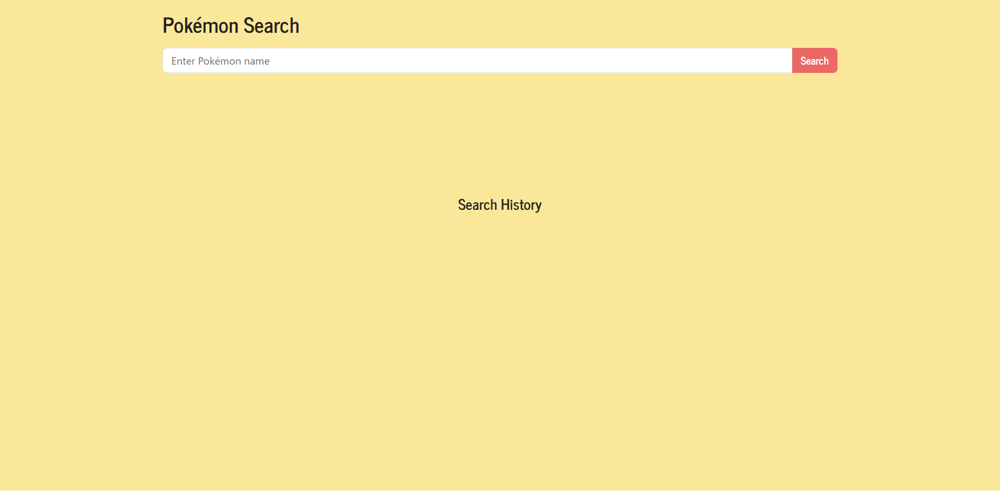
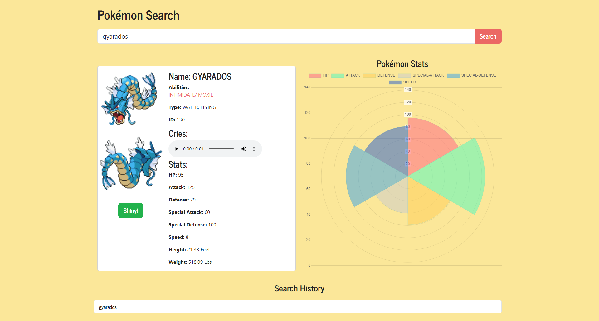

# WEB POKEDEX

## Intro
This is a simple web application that allows uers to sarch for pokemon by name, view their details, and see their stats visualized using Chart.js. It also maintains a search history for quick access to previously searched pokemon.

## Usage
- **1**: Enter the name of a pokemon into the search bar
- **2**: Click the "Search" button
- **3**: View pokemon details
- **4**: Click the "Shiny!" button to toggle between regular and shiny sprites
- **5**: Click on any name in the search history to quickly search for that pokemon again 

## URLs
[Github Repo](https://github.com/aharper2568/web-pokedex)\
[Live URL](https://aharper2568.github.io/web-pokedex/)

## Screenshots

## Tech Used
- [jQuery](https://jquery.com/)
- [Bootswatch](https://bootswatch.com/)
- [Chart.js](https://www.chartjs.org/)
- [PokeAPI](https://pokeapi.co/)

## Authors and Contributors

Developed in VSCode by **Anthony Harper** and **Bryson Shoffner**

[.join method used to concateninate strings for types and abilities and seperate them](https://developer.mozilla.org/en-US/docs/Web/JavaScript/Reference/Global_Objects/Array/join)  
[.destroy method, only known method used to completely delete chart before rendering a new one](https://www.chartjs.org/docs/latest/developers/api.html#destroy)

